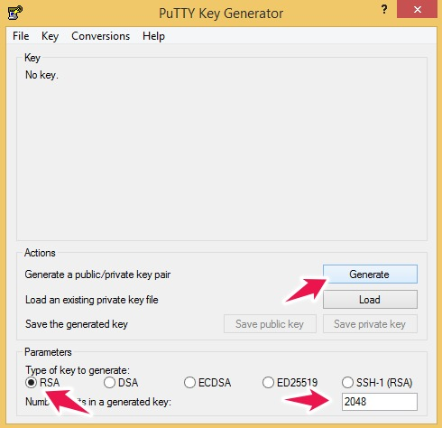
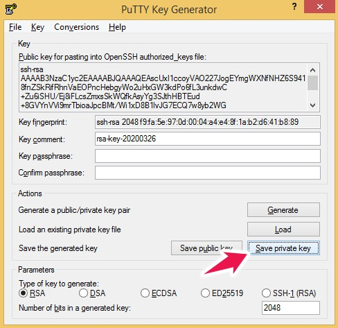
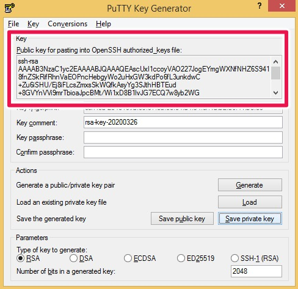
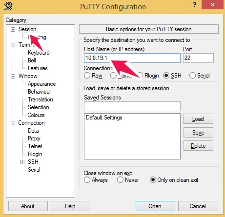
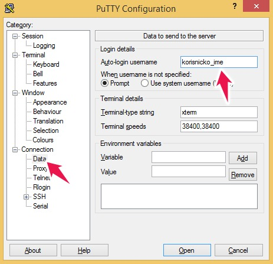
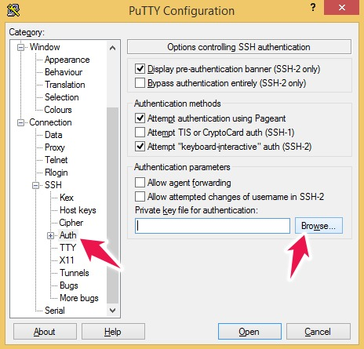
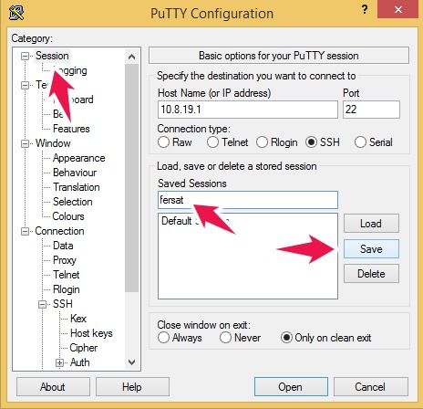
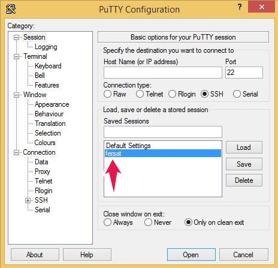

# Spajanje na server - OpenVPN, SSH

## OpenVPN

### Windows

- Preuzmite i instalirajte [OpenVPN](https://openvpn.net/community-downloads/), Windows installer.
- Od administratora/ice sustava dobit ćete datoteke potrebne za spajanje:
    - `fersat.ovpn` - konfiguracijska datoteka ([primjer](assets/files/fersat_win_primjer.ovpn))
    - `ta.key` - OpenVPN statički ključ
    - `ca.crt` - CA certifikat
    - `korisnicko_ime.crt` - korisnički certifikat
    - `korisnicko_ime.key` - korisnički privatni ključ
- Navedene datoteke kopirajte u `C:\Program Files\OpenVPN\config`.
- Pokrenite OpenVPN GUI i spojite se na server (`Connect`).

### Linux

- Instalirajte OpenVPN paket na način prikladan za distribuciju koju koristite, npr.
    - `sudo apt-get install openvpn` ili 
    - `sudo yum install openvpn`
- Od administratora/ice sustava dobit ćete datoteke potrebne za spajanje:
    - `fersat.conf` - konfiguracijska datoteka ([primjer](assets/files/fersat_linux_primjer.conf))
    - `ta.key` - OpenVPN statički ključ
    - `ca.crt` - CA certifikat
    - `korisnicko_ime.crt` - korisnički certifikat
    - `korisnicko_ime.key` - korisnički privatni ključ
- Navedene datoteke kopirajte u direktorij po želji.
- Spojite se na server: `sudo openvpn fersat.conf`. Molimo konzultirajte dokumentaciju svoje Linux distribucije ukoliko želite konfigurirati spajanje kroz grafičko sučelje.

## SSH

### Windows - PuTTY

- Preuzmite i instalirajte [PuTTY](https://www.chiark.greenend.org.uk/~sgtatham/putty/latest.html), Windows installer.
- Generirajte par SSH ključeva pomoću `PuTTYgen` aplikacije:
    - odaberite 2048 bit RSA ključ
    - kliknuti na gumb "Generate" <br><br>
    
    - kliknite na "Save private key" i snimite privatni ključ kao "PPK" (PuTTY Private Key) datoteku. <br><br>
    
    - Kopirajte javni ključ (copy/paste) i dostavite ga e-mailom administratoru/ici. <br><br>
    
    - Čekajte potvrdu da je javni ključ dodan na server.
    - Privatni ključ je tajan i ne šaljete ga nikome.
- Pokrenite `PuTTY` aplikaciju
- Pod "Session" / "Host Name (or IP address)" unesite `10.8.19.1` <br><br>

- Pod "Connection" / "Data" / "Auto-login username" unesite vaše korisničko ime <br><br>

- Pod "Connection" / "SSH" / "Auth" / "Private key file for authentication" kliknite na "Browse..." i odaberite prethodno generiranu PPK datoteku <br><br>

- Vratite se na "Session" i upišite npr. `fersat` pod "Saved Sessions"; kliknite na "Save". <br><br>

- Pod "Session" / "Saved Sessions" dvaput kliknite na `fersat` kako bi se spojili na server. <br><br>

- `fersat` će biti dostupan pod "Session" / "Saved Sessions" kod svakog idućeg pokretanja `PuTTY` aplikacije.

### Linux

- Ukoliko već nemate par SSH ključeva, generirajte ga:
    - `ssh-keygen -t rsa -b 2048`
- Javni ključ (obično sadržaj datoteke `id_rsa.pub`) dostavite e-mailom administratoru/ici. Čekajte potvrdu da je javni ključ dodan na server.
- Spojite se na server:
    - `ssh korisnicko_ime@10.8.19.1`
- Alternativno, možete ažurirati datoteku `~/.ssh/config` i dodati sljedeće linije:
```
Host fersat
    HostName 10.8.19.1
	User korisnicko_ime
	Port 22
```
- Nakon ažuriranja `~/.ssh/config` datoteke, na server se možete spojiti na sljedeći način:
    - `ssh fersat`

### Prekidanje SSH konekcije

Stisnite `CTRL-D` ili unesite naredbu `exit`.
